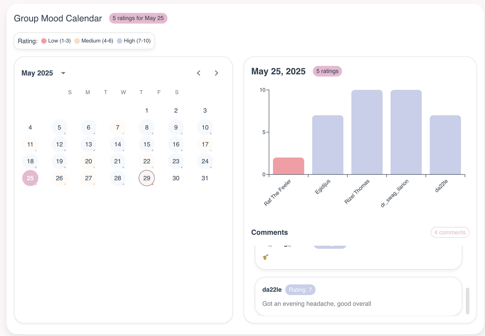

# HowUFeeling 

A web application that helps me and my friends track and share emotional wellbeing.

## 🌟 Core Features

- Create and join private support groups
- Track daily moods and emotional states
- Add context and notes to your entries
- View patterns in your emotional journey
- Manage group memberships and roles
- Get real-time updates on group activity
- Spotify intergation to choose "Song of the day"
- Automated email notification upon leaving the rating

## 💻 Technologies

- **Frontend**: React with TypeScript
- **UI Framework**: Material-UI (MUI) components
- **Authentication**: Firebase Auth with Google sign-in
- **Database**: Firebase Realtime Database
- **Hosting**: Firebase Hosting
- **State Management**: React Context API
- **Routing**: React Router v7

## 🎨 User Experience

- Clean, minimalist interface focused on ease of use
- Fully responsive design for all devices
- Real-time updates and notifications
- Secure and private group spaces
- Intuitive mood tracking and visualization

## 🚀 Getting Started

### Prerequisites

- Node.js (v16 or higher)
- npm or yarn
- Firebase account
- Git

### Installation

1. Clone the repository:

   ```bash
   git clone https://github.com/yourusername/howufeel.git
   cd howufeel
   ```

2. Install dependencies:

   ```bash
   npm install
   ```

3. Set up environment variables:

   - Copy `.env.example` to `.env`
   - Update the values with your Firebase project credentials
   - For local development, copy `.env.example` to `.env.development`

4. Start the development server:
   ```bash
   npm run dev
   ```

### Environment Configuration

The application requires several environment variables to be set. See `.env.example` for the required variables:

- **Firebase Configuration**: Required for authentication and database access
- **Emulator Configuration**: Optional, for local development with Firebase emulators

### Development Workflow

1. **Local Development**

   ```bash
   # Start development server
   npm run dev

   # Start with Firebase emulators
   npm run dev:full
   ```

2. **Testing**

   ```bash
   # Run all tests
   npm test

   # Run security rules tests
   npm run test:rules
   ```

3. **Building for Production**
   ```bash
   npm run build
   ```

### Firebase Setup

1. Create a new Firebase project
2. Enable Authentication with Google sign-in
3. Set up Firestore Database
4. Configure Firebase Hosting
5. Copy your Firebase configuration to your environment files

## 📝 Contributing

1. Fork the repository
2. Create your feature branch (`git checkout -b feature/AmazingFeature`)
3. Commit your changes (`git commit -m 'Add some AmazingFeature'`)
4. Push to the branch (`git push origin feature/AmazingFeature`)
5. Open a Pull Request

## 📄 License

This project is licensed under the MIT License - see the [LICENSE](LICENSE) file for details.
